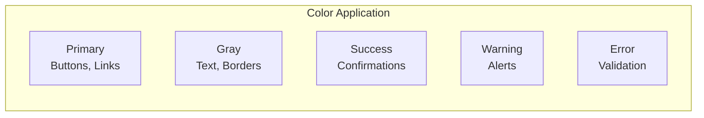

# TaskFlow Design Tokens

## Overview

Design tokens are the visual design atoms of the TaskFlow design system. They define colors, typography, spacing, and other foundational values used across all components.

---

## Color Palette

### Primary Colors

```css
/* Primary Brand Colors */
--color-primary-50:  #eff6ff;
--color-primary-100: #dbeafe;
--color-primary-200: #bfdbfe;
--color-primary-300: #93c5fd;
--color-primary-400: #60a5fa;
--color-primary-500: #3b82f6;  /* Main primary */
--color-primary-600: #2563eb;
--color-primary-700: #1d4ed8;
--color-primary-800: #1e40af;
--color-primary-900: #1e3a8a;
```

### Semantic Colors

```css
/* Success */
--color-success-50:  #f0fdf4;
--color-success-100: #dcfce7;
--color-success-500: #22c55e;  /* Main success */
--color-success-600: #16a34a;
--color-success-700: #15803d;

/* Warning */
--color-warning-50:  #fffbeb;
--color-warning-100: #fef3c7;
--color-warning-500: #f59e0b;  /* Main warning */
--color-warning-600: #d97706;
--color-warning-700: #b45309;

/* Error */
--color-error-50:  #fef2f2;
--color-error-100: #fee2e2;
--color-error-500: #ef4444;  /* Main error */
--color-error-600: #dc2626;
--color-error-700: #b91c1c;

/* Info */
--color-info-50:  #ecfeff;
--color-info-100: #cffafe;
--color-info-500: #06b6d4;  /* Main info */
--color-info-600: #0891b2;
--color-info-700: #0e7490;
```

### Neutral Colors

```css
/* Gray Scale */
--color-gray-50:  #f9fafb;
--color-gray-100: #f3f4f6;
--color-gray-200: #e5e7eb;
--color-gray-300: #d1d5db;
--color-gray-400: #9ca3af;
--color-gray-500: #6b7280;
--color-gray-600: #4b5563;
--color-gray-700: #374151;
--color-gray-800: #1f2937;
--color-gray-900: #111827;
--color-gray-950: #030712;
```

### Task Priority Colors

```css
/* Priority Indicators */
--color-priority-low:    #22c55e;  /* Green */
--color-priority-medium: #f59e0b;  /* Amber */
--color-priority-high:   #ef4444;  /* Red */
```

### Task Status Colors

```css
/* Status Indicators */
--color-status-pending:     #6b7280;  /* Gray */
--color-status-in-progress: #3b82f6;  /* Blue */
--color-status-completed:   #22c55e;  /* Green */
```

---

## Color Usage



| Color | Usage | Example |
|-------|-------|---------|
| Primary-500 | Primary buttons, links | "Create Task" button |
| Primary-600 | Button hover states | Hover on primary button |
| Gray-900 | Headings, body text | Task titles |
| Gray-500 | Secondary text | Timestamps, descriptions |
| Gray-200 | Borders, dividers | Card borders |
| Success-500 | Success messages | "Task completed!" |
| Error-500 | Error states | Validation errors |

---

## Typography

### Font Family

```css
/* Font Stack */
--font-sans: 'Inter', ui-sans-serif, system-ui, -apple-system, sans-serif;
--font-mono: 'JetBrains Mono', ui-monospace, monospace;
```

### Font Sizes

```css
/* Type Scale */
--text-xs:   0.75rem;   /* 12px */
--text-sm:   0.875rem;  /* 14px */
--text-base: 1rem;      /* 16px */
--text-lg:   1.125rem;  /* 18px */
--text-xl:   1.25rem;   /* 20px */
--text-2xl:  1.5rem;    /* 24px */
--text-3xl:  1.875rem;  /* 30px */
--text-4xl:  2.25rem;   /* 36px */
```

### Font Weights

```css
/* Weight Scale */
--font-normal:   400;
--font-medium:   500;
--font-semibold: 600;
--font-bold:     700;
```

### Line Heights

```css
/* Line Height Scale */
--leading-tight:  1.25;
--leading-snug:   1.375;
--leading-normal: 1.5;
--leading-relaxed: 1.625;
```

### Typography Styles

| Style | Size | Weight | Line Height | Usage |
|-------|------|--------|-------------|-------|
| Heading 1 | 2.25rem | Bold | 1.25 | Page titles |
| Heading 2 | 1.5rem | Semibold | 1.375 | Section headers |
| Heading 3 | 1.25rem | Semibold | 1.375 | Card headers |
| Body | 1rem | Normal | 1.5 | Paragraphs |
| Body Small | 0.875rem | Normal | 1.5 | Secondary text |
| Caption | 0.75rem | Medium | 1.5 | Labels, hints |

---

## Spacing

### Spacing Scale

```css
/* Spacing Scale (4px base) */
--space-0:   0;
--space-0.5: 0.125rem;  /* 2px */
--space-1:   0.25rem;   /* 4px */
--space-1.5: 0.375rem;  /* 6px */
--space-2:   0.5rem;    /* 8px */
--space-2.5: 0.625rem;  /* 10px */
--space-3:   0.75rem;   /* 12px */
--space-3.5: 0.875rem;  /* 14px */
--space-4:   1rem;      /* 16px */
--space-5:   1.25rem;   /* 20px */
--space-6:   1.5rem;    /* 24px */
--space-8:   2rem;      /* 32px */
--space-10:  2.5rem;    /* 40px */
--space-12:  3rem;      /* 48px */
--space-16:  4rem;      /* 64px */
--space-20:  5rem;      /* 80px */
--space-24:  6rem;      /* 96px */
```

### Component Spacing

| Component | Padding | Gap |
|-----------|---------|-----|
| Button (sm) | 8px 12px | - |
| Button (md) | 10px 16px | - |
| Button (lg) | 12px 20px | - |
| Card | 16px | 12px |
| Modal | 24px | 16px |
| Form Field | - | 8px |
| List Item | 12px 16px | - |

---

## Border Radius

```css
/* Border Radius Scale */
--radius-none: 0;
--radius-sm:   0.125rem;  /* 2px */
--radius-md:   0.375rem;  /* 6px */
--radius-lg:   0.5rem;    /* 8px */
--radius-xl:   0.75rem;   /* 12px */
--radius-2xl:  1rem;      /* 16px */
--radius-full: 9999px;    /* Pill shape */
```

| Element | Radius |
|---------|--------|
| Buttons | 6px |
| Cards | 8px |
| Modals | 12px |
| Avatars | Full |
| Badges | Full |
| Inputs | 6px |

---

## Shadows

```css
/* Shadow Scale */
--shadow-sm:   0 1px 2px 0 rgb(0 0 0 / 0.05);
--shadow-md:   0 4px 6px -1px rgb(0 0 0 / 0.1), 0 2px 4px -2px rgb(0 0 0 / 0.1);
--shadow-lg:   0 10px 15px -3px rgb(0 0 0 / 0.1), 0 4px 6px -4px rgb(0 0 0 / 0.1);
--shadow-xl:   0 20px 25px -5px rgb(0 0 0 / 0.1), 0 8px 10px -6px rgb(0 0 0 / 0.1);
--shadow-2xl:  0 25px 50px -12px rgb(0 0 0 / 0.25);
--shadow-inner: inset 0 2px 4px 0 rgb(0 0 0 / 0.05);
```

| Element | Shadow |
|---------|--------|
| Cards | shadow-md |
| Dropdowns | shadow-lg |
| Modals | shadow-xl |
| Buttons (hover) | shadow-sm |
| Inputs (focus) | shadow-sm + ring |

---

## Z-Index

```css
/* Z-Index Scale */
--z-0:       0;
--z-10:      10;    /* Sticky elements */
--z-20:      20;    /* Dropdowns */
--z-30:      30;    /* Fixed headers */
--z-40:      40;    /* Modals */
--z-50:      50;    /* Tooltips */
--z-max:     9999;  /* Emergency overrides */
```

---

## Transitions

```css
/* Duration */
--duration-75:   75ms;
--duration-100:  100ms;
--duration-150:  150ms;
--duration-200:  200ms;
--duration-300:  300ms;
--duration-500:  500ms;

/* Timing Functions */
--ease-linear:      linear;
--ease-in:          cubic-bezier(0.4, 0, 1, 1);
--ease-out:         cubic-bezier(0, 0, 0.2, 1);
--ease-in-out:      cubic-bezier(0.4, 0, 0.2, 1);
--ease-bounce:      cubic-bezier(0.68, -0.55, 0.265, 1.55);
```

---

## Dark Mode Tokens

```css
/* Dark Mode Overrides */
:root[data-theme="dark"] {
  /* Backgrounds */
  --color-bg-primary:   #111827;
  --color-bg-secondary: #1f2937;
  --color-bg-tertiary:  #374151;

  /* Text */
  --color-text-primary:   #f9fafb;
  --color-text-secondary: #9ca3af;
  --color-text-tertiary:  #6b7280;

  /* Borders */
  --color-border: #374151;

  /* Primary (slightly lighter for dark mode) */
  --color-primary-500: #60a5fa;
}
```

---

## Tailwind Configuration

```javascript
// tailwind.config.js
module.exports = {
  theme: {
    extend: {
      colors: {
        primary: {
          50: '#eff6ff',
          500: '#3b82f6',
          600: '#2563eb',
          // ...
        },
        success: {
          500: '#22c55e',
        },
        warning: {
          500: '#f59e0b',
        },
        error: {
          500: '#ef4444',
        },
      },
      fontFamily: {
        sans: ['Inter', 'ui-sans-serif', 'system-ui'],
        mono: ['JetBrains Mono', 'monospace'],
      },
    },
  },
};
```

---

## Related Documents

- [Components](./components.md)
- [Layouts](./layouts.md)
- [Accessibility](./accessibility.md)
