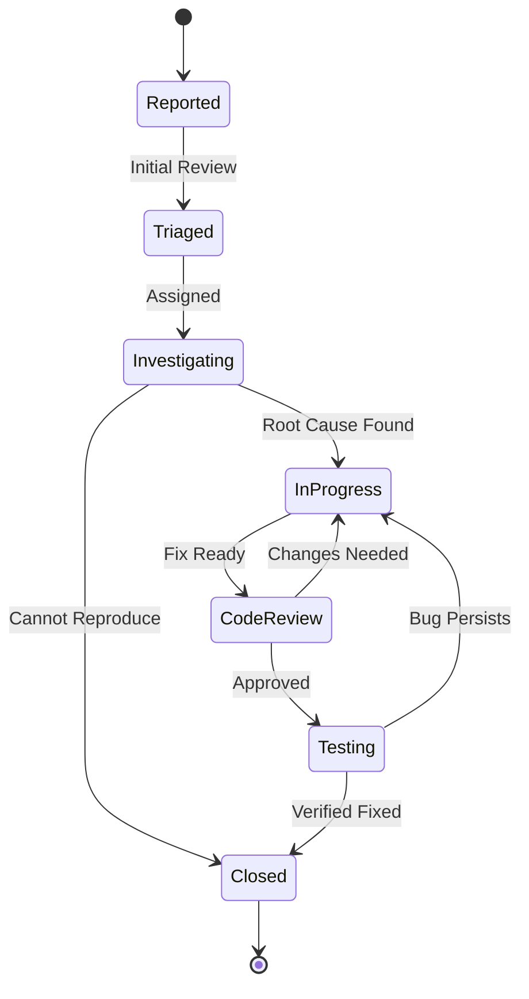
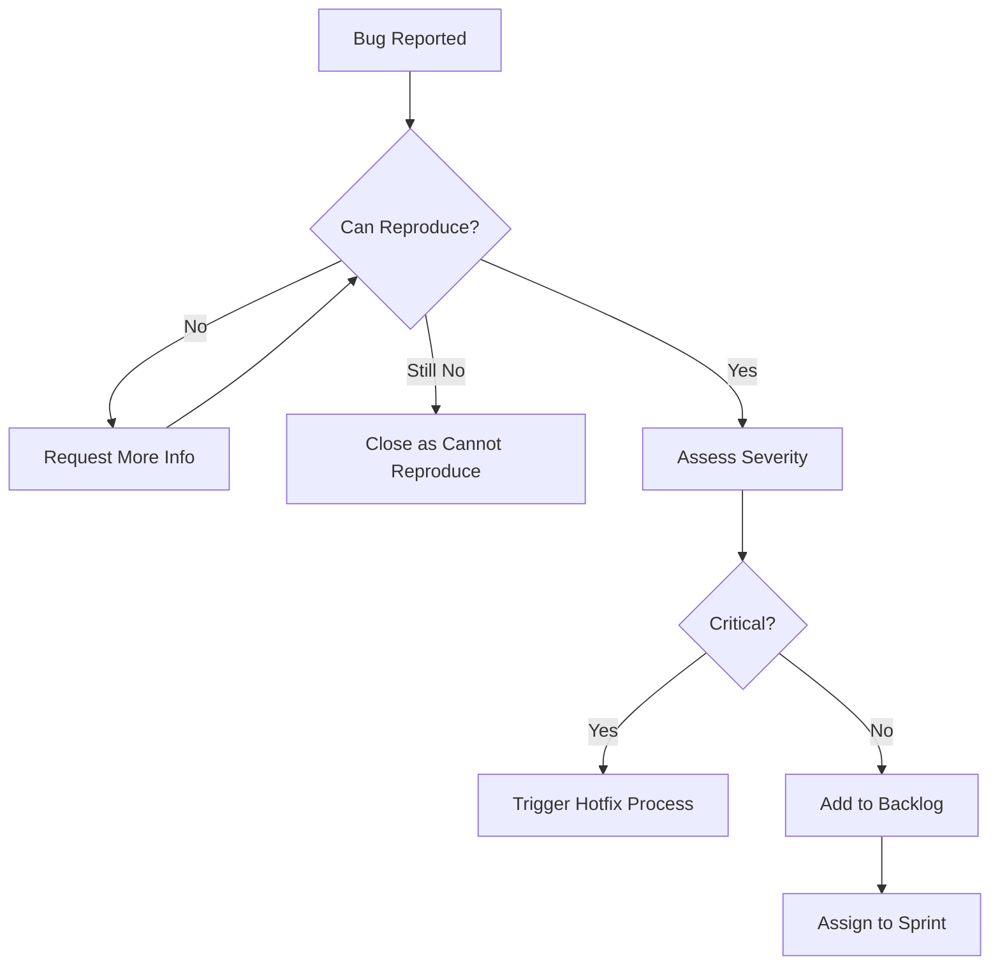
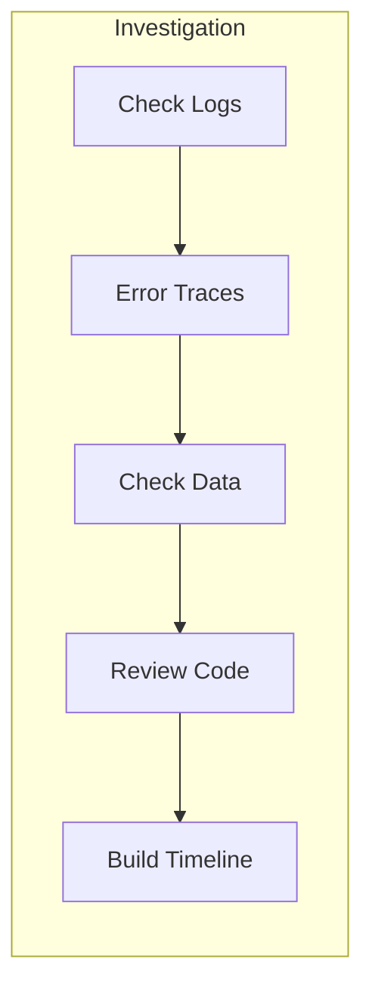
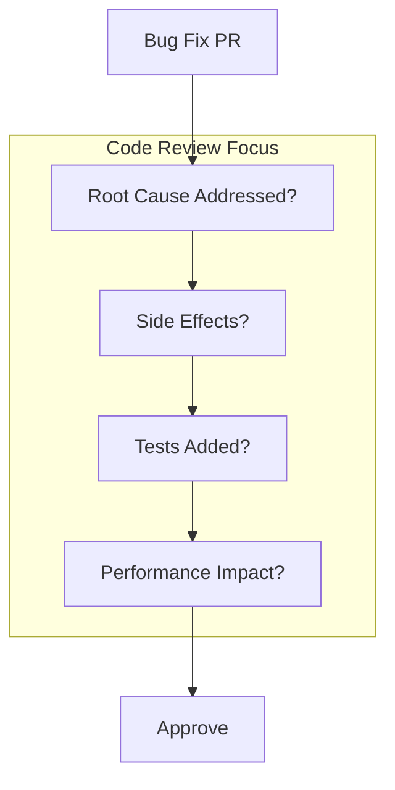
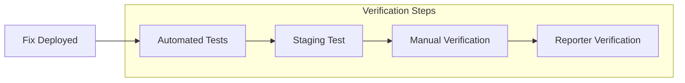
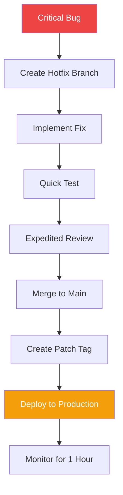

# TaskFlow Bug Fix Workflow

## Overview

This document outlines the standard process for identifying, triaging, fixing, and verifying bugs in TaskFlow. Following this workflow ensures bugs are handled efficiently and don't recur.

---

## Bug Lifecycle



---

## Phase 1: Bug Reporting

### Bug Report Template

```markdown
## Bug Report: [Brief Description]

### Environment
- Browser: Chrome 120
- OS: macOS 14.2
- User Role: Standard User
- Account: test@example.com

### Steps to Reproduce
1. Navigate to /tasks
2. Click "Create Task" button
3. Enter task title
4. Click "Save"

### Expected Behavior
Task should be created and appear in the task list.

### Actual Behavior
Error message: "Failed to create task" appears.
Task is not created.

### Screenshots/Videos
[Attach visual evidence]

### Console Errors
```
POST /api/tasks 500 Internal Server Error
TypeError: Cannot read property 'id' of undefined
```

### Additional Context
This started happening after the last deployment.
Affects all users, not just my account.
```

### Bug Severity Matrix

| Severity | Impact | Response Time | Examples |
|----------|--------|---------------|----------|
| Critical | System unusable | < 2 hours | Login broken, data loss |
| High | Major feature broken | < 8 hours | Cannot create tasks |
| Medium | Feature degraded | < 2 days | Slow performance |
| Low | Minor inconvenience | Next sprint | UI alignment |

---

## Phase 2: Triage

### Triage Workflow



### Triage Checklist

```markdown
## Triage Checklist

### Reproduction
- [ ] Bug can be reproduced locally
- [ ] Steps to reproduce are documented
- [ ] Environment details captured

### Assessment
- [ ] Severity assigned (Critical/High/Medium/Low)
- [ ] Affected users identified (all/subset/single)
- [ ] Business impact evaluated
- [ ] Root cause hypothesis formed

### Assignment
- [ ] Owner assigned
- [ ] Sprint/priority assigned
- [ ] Related issues linked
- [ ] Labels applied
```

---

## Phase 3: Investigation

### Investigation Steps



### Debug Checklist

```bash
# 1. Check application logs
docker logs taskflow-api --tail 100

# 2. Check error tracking (Sentry)
# Look for error in Sentry dashboard

# 3. Query database
psql $DATABASE_URL -c "
  SELECT * FROM tasks
  WHERE user_id = 'affected-user-id'
  ORDER BY created_at DESC
  LIMIT 10;
"

# 4. Check recent deployments
gh release list --limit 5

# 5. Check recent commits to affected area
git log --oneline -10 -- src/services/taskService.ts
```

### Root Cause Template

```markdown
## Root Cause Analysis: TF-456

### Summary
Task creation fails with 500 error when user has no default project.

### Timeline
- 2024-01-15 10:30: Feature deployed (PR #445)
- 2024-01-15 14:00: First error report
- 2024-01-15 14:15: Investigation started
- 2024-01-15 15:00: Root cause identified

### Root Cause
The task service assumes user always has a default project:
```typescript
// Bug: defaultProject could be undefined
const project = await getDefaultProject(userId);
task.projectId = project.id; // Throws if project is undefined
```

### Impact
- Affected: 15 users (those without default project)
- Duration: 3.5 hours
- Data loss: None

### Fix
Add null check and create default project if missing:
```typescript
let project = await getDefaultProject(userId);
if (!project) {
  project = await createDefaultProject(userId);
}
task.projectId = project.id;
```

### Prevention
- Add test case for users without default project
- Add monitoring alert for 500 errors on /api/tasks
```

---

## Phase 4: Fix Implementation

### Branch Naming

```bash
# Regular bug fix
git checkout -b fix/TF-456-task-creation-error

# Hotfix (critical bugs)
git checkout -b hotfix/task-creation-null-check
```

### Fix Requirements

```markdown
## Fix PR Checklist

### Code Changes
- [ ] Fix addresses root cause (not just symptoms)
- [ ] Fix is minimal and focused
- [ ] No unrelated changes included
- [ ] Error handling improved

### Testing
- [ ] Unit test for the specific bug scenario
- [ ] Regression tests for related functionality
- [ ] Test passes locally
- [ ] Manual verification completed

### Documentation
- [ ] Code comments added if logic is complex
- [ ] Error messages are user-friendly
- [ ] Related documentation updated
```

### Test-Driven Fix

```typescript
// 1. Write failing test first
describe('TaskService', () => {
  describe('createTask', () => {
    it('should create task when user has no default project', async () => {
      // Arrange
      const userId = 'user-without-project';
      await deleteAllProjects(userId); // Ensure no projects

      // Act
      const task = await taskService.createTask(userId, {
        title: 'Test Task',
      });

      // Assert
      expect(task).toBeDefined();
      expect(task.projectId).toBeDefined();
    });
  });
});

// 2. Implement fix to make test pass
async function createTask(userId: string, data: CreateTaskDto) {
  let project = await getDefaultProject(userId);

  // Fix: Create default project if none exists
  if (!project) {
    project = await projectService.createDefault(userId);
  }

  return taskRepository.create({
    ...data,
    userId,
    projectId: project.id,
  });
}

// 3. Verify test passes
// npm test -- --grep "no default project"
```

---

## Phase 5: Code Review

### Review Focus Areas



### Review Checklist

```markdown
## Bug Fix Review Checklist

### Correctness
- [ ] Fix addresses the actual root cause
- [ ] Fix handles edge cases
- [ ] No regression in related features

### Quality
- [ ] Code follows project conventions
- [ ] No unnecessary complexity added
- [ ] Error messages are helpful

### Testing
- [ ] New test reproduces the bug
- [ ] Test verifies the fix
- [ ] Existing tests still pass

### Safety
- [ ] No data migration needed
- [ ] Backward compatible
- [ ] Rollback plan exists
```

---

## Phase 6: Verification

### Testing Protocol



### Verification Steps

```markdown
## Bug Verification: TF-456

### Automated Testing
- [x] Unit tests pass
- [x] Integration tests pass
- [x] E2E tests pass

### Staging Verification
- [x] Deployed to staging
- [x] Bug scenario tested
- [x] Edge cases tested

### Manual Testing
Steps performed:
1. Created new user without projects
2. Attempted to create task
3. Verified task created successfully
4. Verified default project was created

### Reporter Sign-off
- [ ] Original reporter verified fix
- [ ] No new issues introduced
```

---

## Hotfix Process

### When to Hotfix

```
Hotfix Criteria:
- Critical severity bugs
- Affecting majority of users
- No workaround available
- Cannot wait for next release
```

### Hotfix Workflow



### Hotfix Commands

```bash
# 1. Create hotfix branch from main
git checkout main
git pull origin main
git checkout -b hotfix/critical-task-bug

# 2. Make minimal fix
# ... edit files ...

# 3. Commit with hotfix prefix
git commit -m "hotfix: prevent task creation crash for new users"

# 4. Push and create PR
git push -u origin hotfix/critical-task-bug
gh pr create --title "HOTFIX: Task creation crash" --label "hotfix"

# 5. After approval and merge, tag release
git checkout main
git pull origin main
git tag v1.2.1
git push origin v1.2.1
```

---

## Post-Fix Actions

### Monitoring

```markdown
## Post-Fix Monitoring Checklist

- [ ] Error rate returned to baseline
- [ ] No new related errors
- [ ] Performance metrics stable
- [ ] User complaints stopped
```

### Documentation

```markdown
## Bug Post-Mortem Template

### Incident Summary
- Bug ID: TF-456
- Duration: 3.5 hours
- Impact: 15 users affected

### Timeline
| Time | Event |
|------|-------|
| 10:30 | Buggy code deployed |
| 14:00 | First report received |
| 14:15 | Investigation started |
| 15:00 | Root cause identified |
| 15:30 | Fix deployed |
| 15:45 | Verified fixed |

### Lessons Learned
1. Need tests for edge cases
2. Need monitoring for creation endpoints
3. Code review should check null safety

### Action Items
- [ ] Add null safety linting rule
- [ ] Increase test coverage for task creation
- [ ] Add 500 error alerting
```

---

## Related Documents

- [Development Workflow](./development.md)
- [QA Review Process](./qa-review.md)
- [Testing Strategy](../testing/strategy.md)
