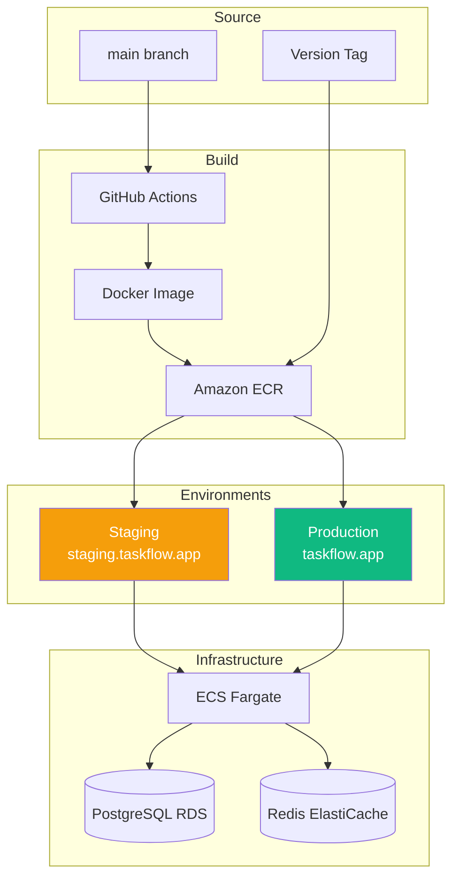
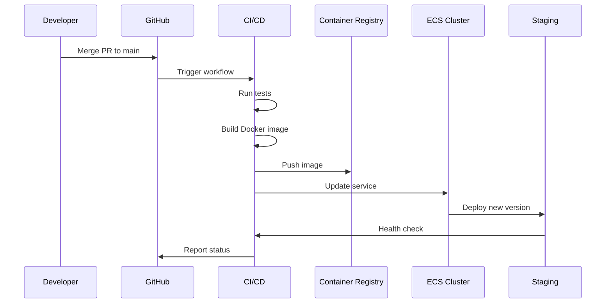
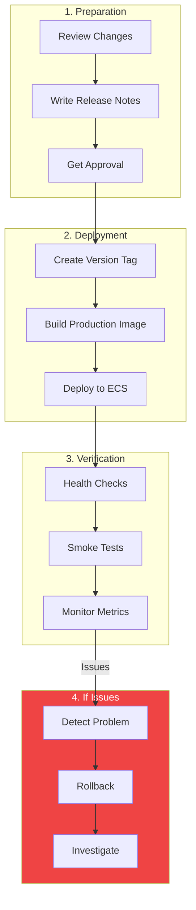
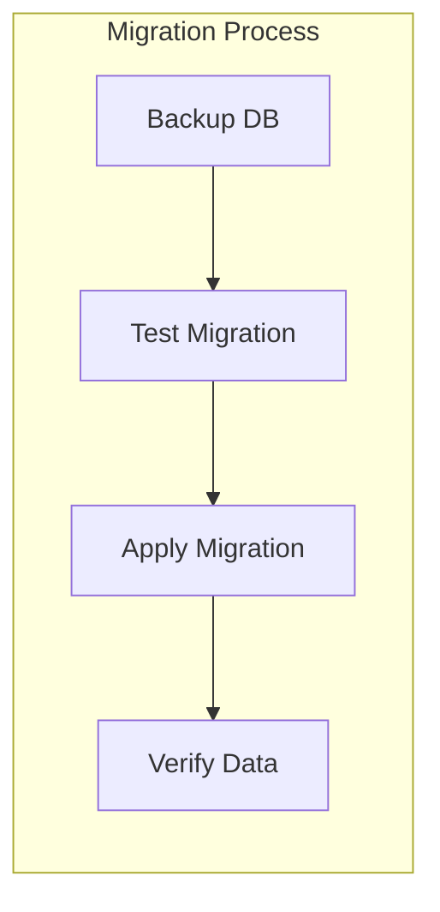
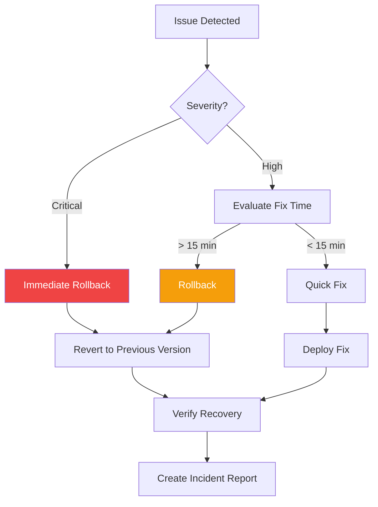
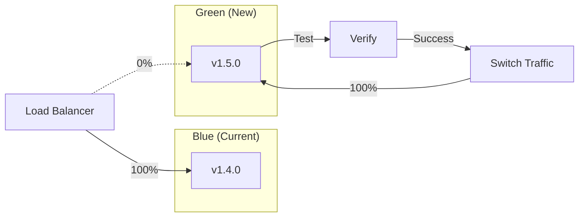

# TaskFlow Deployment Process

## Overview

This document covers the deployment process for TaskFlow, including staging and production deployments, rollback procedures, and monitoring.

---

## Deployment Architecture



---

## Deployment Environments

| Environment | URL | Trigger | Approval |
|-------------|-----|---------|----------|
| Development | localhost:3000 | Local | None |
| Staging | staging.taskflow.app | Push to main | Automatic |
| Production | taskflow.app | Version tag | Manual |

---

## Staging Deployment

### Automatic Deployment Flow



### Staging Deployment Steps

```bash
# Staging deploys automatically on merge to main
# Manual trigger if needed:

# 1. Check current deployment
aws ecs describe-services \
  --cluster taskflow-staging \
  --services taskflow-api \
  --query 'services[0].deployments'

# 2. Trigger new deployment
aws ecs update-service \
  --cluster taskflow-staging \
  --service taskflow-api \
  --force-new-deployment

# 3. Watch deployment progress
aws ecs wait services-stable \
  --cluster taskflow-staging \
  --services taskflow-api

# 4. Verify deployment
curl https://staging.taskflow.app/health
```

### Staging Verification Checklist

```markdown
## Staging Deployment Checklist

### Pre-Deployment
- [ ] All PR tests passed
- [ ] Code review approved
- [ ] No critical bugs in staging

### Deployment
- [ ] New image pushed to ECR
- [ ] ECS service updated
- [ ] Health checks passing

### Post-Deployment
- [ ] Smoke tests pass
- [ ] Key user flows work
- [ ] No new errors in logs
- [ ] Performance acceptable
```

---

## Production Deployment

### Release Process



### Production Deployment Steps

```bash
# 1. Ensure staging is verified
curl https://staging.taskflow.app/health

# 2. Create release tag
git checkout main
git pull origin main
git tag -a v1.5.0 -m "Release v1.5.0: Task labels feature"
git push origin v1.5.0

# 3. GitHub Actions will:
#    - Build production Docker image
#    - Push to ECR with version tag
#    - Deploy to production ECS

# 4. Monitor deployment
aws ecs describe-services \
  --cluster taskflow-production \
  --services taskflow-api \
  --query 'services[0].{desired:desiredCount,running:runningCount,deployments:deployments}'

# 5. Verify production
curl https://taskflow.app/health
```

### Production Checklist

```markdown
## Production Deployment Checklist

### Pre-Deployment
- [ ] Staging verified for 24+ hours
- [ ] Release notes prepared
- [ ] Stakeholders notified
- [ ] Deployment window confirmed
- [ ] Rollback plan ready
- [ ] On-call engineer available

### During Deployment
- [ ] Version tag created
- [ ] Docker image built
- [ ] Image pushed to ECR
- [ ] ECS deployment started
- [ ] Health checks monitored

### Post-Deployment (First 30 min)
- [ ] All health checks green
- [ ] Error rates normal
- [ ] Response times normal
- [ ] Key user flows tested
- [ ] No customer complaints

### Post-Deployment (First 24 hours)
- [ ] Monitor error tracking
- [ ] Check performance dashboards
- [ ] Review customer feedback
- [ ] Update deployment log
```

---

## Database Migrations

### Migration Strategy



### Migration Commands

```bash
# 1. Generate migration
npx prisma migrate dev --name add_labels_table

# 2. Review generated SQL
cat prisma/migrations/*/migration.sql

# 3. Test migration on staging
DATABASE_URL=$STAGING_DB npx prisma migrate deploy

# 4. Verify staging data
psql $STAGING_DB -c "SELECT COUNT(*) FROM labels;"

# 5. Apply to production (during deployment)
DATABASE_URL=$PROD_DB npx prisma migrate deploy
```

### Migration Best Practices

```markdown
## Migration Safety Rules

### DO
- Make migrations backward compatible
- Add columns with defaults
- Create indexes concurrently
- Test with production-like data
- Have rollback scripts ready

### DON'T
- Drop columns in same release as code change
- Add NOT NULL without default
- Run long migrations during peak hours
- Modify production data directly
```

---

## Rollback Procedures

### When to Rollback

```
Rollback Triggers:
- Error rate > 5% (normal < 0.1%)
- P95 response time > 2s (normal < 300ms)
- Health checks failing
- Critical user flows broken
- Data integrity issues
```

### Rollback Process



### Rollback Commands

```bash
# Option 1: Revert to previous ECS task definition
PREVIOUS_TASK=$(aws ecs describe-services \
  --cluster taskflow-production \
  --services taskflow-api \
  --query 'services[0].deployments[1].taskDefinition' \
  --output text)

aws ecs update-service \
  --cluster taskflow-production \
  --service taskflow-api \
  --task-definition $PREVIOUS_TASK

# Option 2: Deploy specific version
aws ecs update-service \
  --cluster taskflow-production \
  --service taskflow-api \
  --task-definition taskflow-api:42  # Previous version

# Option 3: Revert via Docker tag
# Re-tag previous version as latest
docker pull $ECR_REGISTRY/taskflow:v1.4.0
docker tag $ECR_REGISTRY/taskflow:v1.4.0 $ECR_REGISTRY/taskflow:latest
docker push $ECR_REGISTRY/taskflow:latest

# Then trigger deployment
aws ecs update-service \
  --cluster taskflow-production \
  --service taskflow-api \
  --force-new-deployment
```

### Database Rollback

```bash
# If migration needs rollback
# 1. Check migration status
npx prisma migrate status

# 2. Apply rollback migration (must be prepared ahead)
psql $PROD_DB -f rollback/v1.5.0_rollback.sql

# Example rollback script
# rollback/v1.5.0_rollback.sql
-- Rollback: Remove labels table
-- Only safe if no data or data is backed up
DROP TABLE IF EXISTS task_labels;
DROP TABLE IF EXISTS labels;
```

---

## Deployment Monitoring

### Key Metrics Dashboard

```
┌─────────────────────────────────────────────────────────────┐
│              PRODUCTION DEPLOYMENT MONITOR                   │
├─────────────────────────────────────────────────────────────┤
│                                                              │
│  Version: v1.5.0          Deployed: 2024-01-15 10:30 UTC    │
│                                                              │
│  ┌─────────────────┐  ┌─────────────────┐                   │
│  │  Error Rate     │  │  Response Time  │                   │
│  │    0.05%        │  │    145ms (p95)  │                   │
│  │    ▼ Normal     │  │    ▼ Normal     │                   │
│  └─────────────────┘  └─────────────────┘                   │
│                                                              │
│  ┌─────────────────┐  ┌─────────────────┐                   │
│  │  Requests/sec   │  │  CPU Usage      │                   │
│  │    342 req/s    │  │    45%          │                   │
│  │    ↑ +5%        │  │    → Stable     │                   │
│  └─────────────────┘  └─────────────────┘                   │
│                                                              │
│  Health: ✓ API  ✓ Database  ✓ Cache  ✓ CDN                  │
│                                                              │
└─────────────────────────────────────────────────────────────┘
```

### Monitoring Checklist

```markdown
## Post-Deployment Monitoring

### Immediate (0-15 min)
- [ ] ECS tasks healthy
- [ ] No 5xx errors
- [ ] Response times normal
- [ ] Database connections stable

### Short-term (15 min - 1 hour)
- [ ] Error rate stable
- [ ] Memory usage stable
- [ ] No error spikes in Sentry
- [ ] Customer reports clear

### Long-term (1-24 hours)
- [ ] Performance trends normal
- [ ] No memory leaks
- [ ] Scheduled jobs working
- [ ] Metrics dashboards green
```

---

## Blue-Green Deployment (Future)



---

## Related Documents

- [CI/CD Pipeline](./ci-cd-pipeline.md)
- [Environment Setup](../environments/production.md)
- [Docker Configuration](../environments/docker.md)
