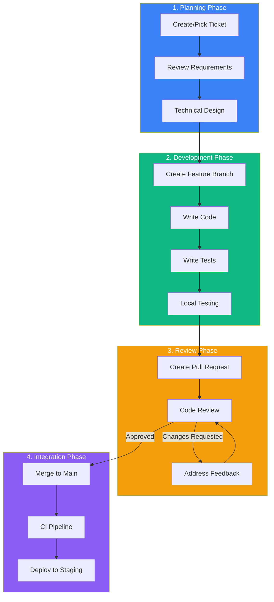
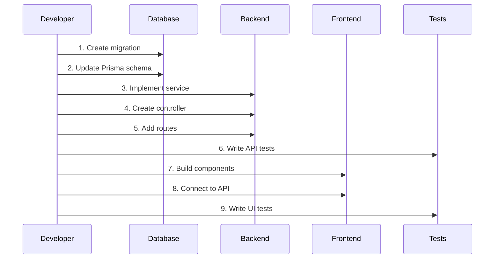
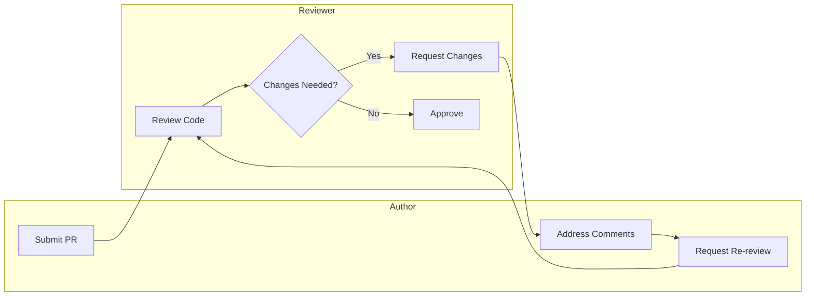
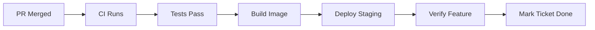

# TaskFlow Feature Development Workflow

## Overview

This document outlines the standard workflow for developing new features in TaskFlow. Following this process ensures code quality, maintainability, and smooth team collaboration.

---

## Development Workflow Diagram



---

## Phase 1: Planning

### 1.1 Ticket Management

Before starting any work, ensure a ticket exists in the project tracker:

```
Ticket Format:
--------------
Title: [FEATURE] Add task labels functionality
Priority: High
Sprint: Sprint 3
Story Points: 5
Assignee: @developer

Acceptance Criteria:
- Users can add labels to tasks
- Labels are color-coded
- Filter tasks by label
- Max 5 labels per task
```

### 1.2 Requirements Review

Checklist before development:
- [ ] Acceptance criteria are clear
- [ ] UI/UX designs are available (if applicable)
- [ ] API contract is defined
- [ ] Edge cases are documented
- [ ] Dependencies are identified

### 1.3 Technical Design

For features requiring more than 2 days of work:

```markdown
## Technical Design: Task Labels

### Database Changes
- New table: `labels` (id, name, color, user_id)
- New junction table: `task_labels` (task_id, label_id)

### API Endpoints
- POST /api/labels - Create label
- GET /api/labels - List user's labels
- POST /api/tasks/:id/labels - Add label to task
- DELETE /api/tasks/:id/labels/:labelId - Remove label

### Frontend Components
- LabelBadge component
- LabelPicker dropdown
- LabelManager modal
```

---

## Phase 2: Development

### 2.1 Branch Creation

```bash
# Sync with main
git checkout main
git pull origin main

# Create feature branch
git checkout -b feature/task-labels

# Branch naming conventions
# feature/  - New features
# fix/      - Bug fixes
# refactor/ - Code refactoring
# docs/     - Documentation
# test/     - Test additions
```

### 2.2 Development Sequence



### 2.3 Code Structure

```
src/
├── backend/
│   ├── controllers/
│   │   └── labelController.ts    # Request handling
│   ├── services/
│   │   └── labelService.ts       # Business logic
│   ├── repositories/
│   │   └── labelRepository.ts    # Data access
│   └── routes/
│       └── labelRoutes.ts        # Route definitions
└── frontend/
    ├── components/
    │   └── labels/
    │       ├── LabelBadge.tsx
    │       ├── LabelPicker.tsx
    │       └── LabelManager.tsx
    ├── hooks/
    │   └── useLabels.ts
    └── api/
        └── labels.ts
```

### 2.4 Coding Standards

```typescript
// Service layer example
// src/backend/services/labelService.ts

import { Label, CreateLabelDto } from '../types/label';
import { labelRepository } from '../repositories/labelRepository';
import { AppError } from '../utils/errors';

export const labelService = {
  async createLabel(userId: string, data: CreateLabelDto): Promise<Label> {
    // Validate label limit
    const existingCount = await labelRepository.countByUser(userId);
    if (existingCount >= 20) {
      throw new AppError('Maximum label limit reached', 400);
    }

    // Check for duplicate names
    const existing = await labelRepository.findByName(userId, data.name);
    if (existing) {
      throw new AppError('Label name already exists', 409);
    }

    return labelRepository.create({ ...data, userId });
  },

  async getLabels(userId: string): Promise<Label[]> {
    return labelRepository.findByUser(userId);
  }
};
```

### 2.5 Local Testing Commands

```bash
# Run backend tests
npm run test:backend

# Run frontend tests
npm run test:frontend

# Run specific test file
npm test -- src/backend/services/labelService.test.ts

# Run tests in watch mode
npm run test:watch

# Check test coverage
npm run test:coverage
```

---

## Phase 3: Review

### 3.1 Pre-PR Checklist

```markdown
Before creating PR:
- [ ] All tests pass locally
- [ ] Linting passes (npm run lint)
- [ ] TypeScript compiles (npm run typecheck)
- [ ] Feature works in browser
- [ ] No console errors/warnings
- [ ] Code is self-documenting
- [ ] Complex logic has comments
```

### 3.2 Pull Request Template

```markdown
## Description
Add task labels functionality allowing users to categorize tasks.

## Type of Change
- [x] New feature
- [ ] Bug fix
- [ ] Refactoring
- [ ] Documentation

## Changes Made
- Added labels table and Prisma model
- Created label CRUD endpoints
- Built LabelPicker component
- Added label filtering to task list

## Screenshots
[Attach UI screenshots]

## Testing
- [x] Unit tests added
- [x] Integration tests added
- [ ] E2E tests added

## Checklist
- [x] Code follows style guidelines
- [x] Self-review completed
- [x] Tests pass
- [x] Documentation updated
```

### 3.3 Code Review Process



---

## Phase 4: Integration

### 4.1 Merge Process

```bash
# Ensure branch is up to date
git checkout feature/task-labels
git rebase main

# Resolve any conflicts
# Then push
git push origin feature/task-labels --force-with-lease

# After PR approval, merge via GitHub UI
# Using "Squash and merge" option
```

### 4.2 Post-Merge Actions



---

## Quick Reference

| Action | Command |
|--------|---------|
| Create branch | `git checkout -b feature/name` |
| Run tests | `npm test` |
| Check types | `npm run typecheck` |
| Lint code | `npm run lint` |
| Format code | `npm run format` |
| Start dev server | `npm run dev` |
| Build project | `npm run build` |

---

## Related Documents

- [Git Workflow](./git-workflow.md)
- [Sprint Execution](./sprint-execution.md)
- [CI/CD Pipeline](./ci-cd-pipeline.md)
- [Coding Standards](../project/coding-standards.md)
