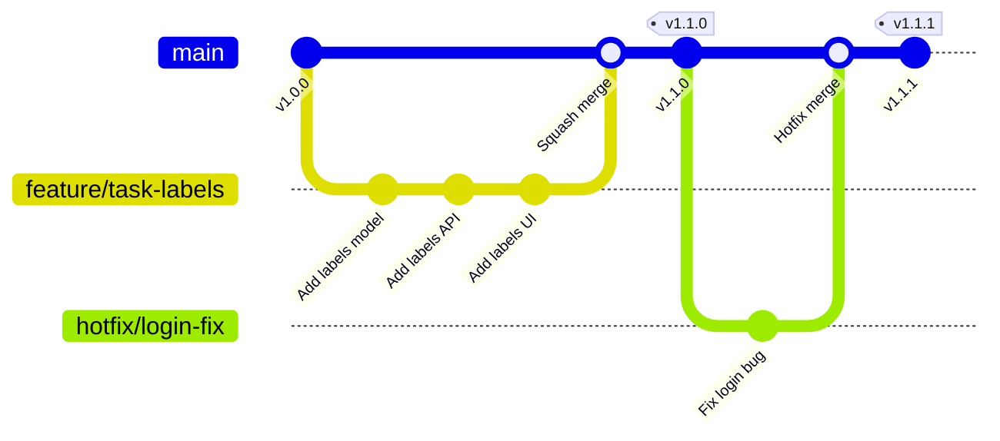
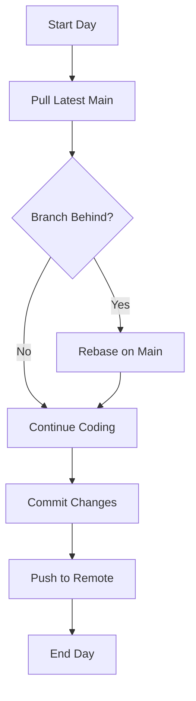
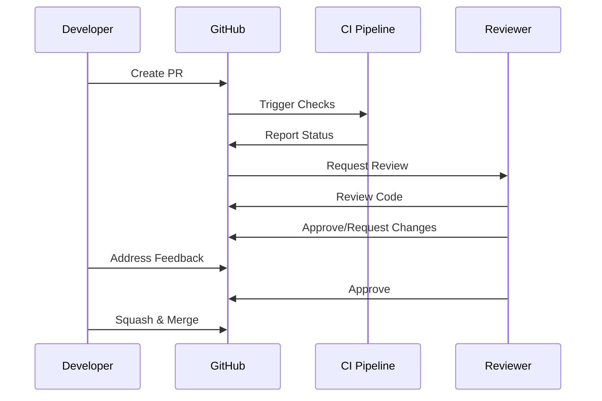
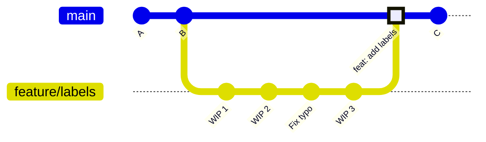

# TaskFlow Git Workflow

## Overview

TaskFlow follows a trunk-based development workflow with short-lived feature branches. This document covers branching strategy, commit conventions, and merge procedures.

---

## Branching Strategy



---

## Branch Types

### Main Branch

```
main
├── Protected branch
├── Always deployable
├── Requires PR approval
└── CI must pass before merge
```

### Feature Branches

```bash
# Naming convention
feature/[ticket-id]-short-description

# Examples
feature/TF-123-task-labels
feature/TF-456-user-avatars
feature/TF-789-dark-mode
```

### Other Branch Types

| Type | Pattern | Purpose | Lifetime |
|------|---------|---------|----------|
| feature/ | feature/TF-xxx-desc | New features | 1-5 days |
| fix/ | fix/TF-xxx-desc | Bug fixes | 1-2 days |
| hotfix/ | hotfix/issue-desc | Production fixes | Hours |
| refactor/ | refactor/area-name | Code refactoring | 1-3 days |
| docs/ | docs/what-updated | Documentation | 1 day |
| test/ | test/what-testing | Test additions | 1-2 days |

---

## Workflow Steps

### Starting New Work

```bash
# 1. Ensure main is up to date
git checkout main
git pull origin main

# 2. Create feature branch
git checkout -b feature/TF-123-task-labels

# 3. Make changes and commit frequently
git add src/models/label.ts
git commit -m "feat(models): add Label model with Prisma schema"

# 4. Push branch to remote
git push -u origin feature/TF-123-task-labels
```

### Daily Workflow



```bash
# Daily sync routine
git checkout main
git pull origin main
git checkout feature/TF-123-task-labels
git rebase main

# If conflicts occur
git status                    # Check conflicting files
# ... resolve conflicts ...
git add <resolved-files>
git rebase --continue
```

---

## Commit Conventions

### Commit Message Format

```
<type>(<scope>): <subject>

[optional body]

[optional footer]
```

### Commit Types

| Type | Description | Example |
|------|-------------|---------|
| feat | New feature | feat(tasks): add task duplication |
| fix | Bug fix | fix(auth): resolve token refresh issue |
| docs | Documentation | docs(readme): update setup instructions |
| style | Formatting | style(ui): fix button alignment |
| refactor | Code restructuring | refactor(api): simplify error handling |
| test | Adding tests | test(tasks): add unit tests for service |
| chore | Maintenance | chore(deps): update dependencies |
| perf | Performance | perf(queries): optimize task listing |

### Scopes

```
Common scopes for TaskFlow:
- tasks      - Task-related changes
- projects   - Project management
- auth       - Authentication
- api        - Backend API
- ui         - Frontend components
- db         - Database changes
- deps       - Dependencies
- ci         - CI/CD pipeline
```

### Commit Examples

```bash
# Feature commit
git commit -m "feat(tasks): add label filtering to task list

- Add LabelFilter component
- Implement filter logic in useTasksQuery
- Add filter state to URL params

Closes TF-123"

# Bug fix commit
git commit -m "fix(auth): prevent token refresh race condition

Multiple simultaneous requests could trigger duplicate
refresh attempts. Added mutex lock to ensure single refresh.

Fixes TF-456"

# Simple commits
git commit -m "docs(api): add rate limiting documentation"
git commit -m "test(labels): add integration tests for label API"
git commit -m "chore(deps): bump React to 18.2.0"
```

---

## Pull Request Process

### PR Workflow



### Creating a PR

```bash
# Ensure branch is ready
git checkout feature/TF-123-task-labels
git rebase main
npm run lint
npm run test
npm run typecheck

# Push final changes
git push origin feature/TF-123-task-labels

# Create PR via GitHub CLI
gh pr create \
  --title "feat(tasks): add label filtering [TF-123]" \
  --body "## Summary
Add ability to filter tasks by labels.

## Changes
- LabelFilter component
- Filter state management
- URL sync for filters

## Testing
- [x] Unit tests
- [x] Manual testing

## Screenshots
[Attach screenshots]"
```

### PR Requirements

```markdown
PR Merge Requirements:
- [ ] At least 1 approval
- [ ] All CI checks passing
- [ ] No merge conflicts
- [ ] Branch is up to date with main
- [ ] PR title follows convention
```

---

## Merge Strategy

### Squash and Merge (Default)



```bash
# Result: Clean single commit on main
# All feature commits squashed into one
```

### When to Use Regular Merge

```
Use regular merge for:
- Hotfix branches (preserve history)
- Large refactors with meaningful commits
- When commit history is important
```

---

## Conflict Resolution

### Common Conflict Scenarios

```bash
# Scenario 1: Rebase conflicts
git rebase main
# CONFLICT in src/components/TaskList.tsx

# Step 1: Check status
git status

# Step 2: Open conflicting file
# Look for conflict markers:
<<<<<<< HEAD
  const tasks = useTasksQuery();
=======
  const tasks = useTasksQuery({ includeLabels: true });
>>>>>>> feature/TF-123

# Step 3: Resolve (keep both changes intelligently)
  const tasks = useTasksQuery({ includeLabels: true });

# Step 4: Stage and continue
git add src/components/TaskList.tsx
git rebase --continue
```

### Prevention Strategies

```markdown
To minimize conflicts:
1. Keep branches short-lived (< 5 days)
2. Rebase daily on main
3. Communicate about shared files
4. Break large features into smaller PRs
```

---

## Git Commands Reference

### Everyday Commands

```bash
# Status and logs
git status
git log --oneline -10
git diff
git diff --staged

# Branching
git branch -a                    # List all branches
git checkout -b branch-name      # Create and switch
git branch -d branch-name        # Delete local branch
git push origin --delete branch  # Delete remote branch

# Committing
git add -p                       # Interactive staging
git commit --amend               # Amend last commit
git reset HEAD~1                 # Undo last commit (keep changes)

# Remote
git fetch origin
git pull origin main
git push -u origin branch-name
git push --force-with-lease      # Safe force push
```

### Recovery Commands

```bash
# Undo uncommitted changes
git checkout -- file.ts          # Discard file changes
git checkout -- .                # Discard all changes

# Undo commits
git reset --soft HEAD~1          # Undo commit, keep staged
git reset --mixed HEAD~1         # Undo commit, unstage
git reset --hard HEAD~1          # Undo commit, discard changes

# Recover deleted branch
git reflog                       # Find commit hash
git checkout -b recovered-branch <hash>

# Recover file from another branch
git checkout main -- path/to/file.ts
```

---

## Branch Protection Rules

```yaml
# GitHub branch protection for main
main:
  required_reviews: 1
  dismiss_stale_reviews: true
  require_status_checks:
    - ci/test
    - ci/lint
    - ci/build
  require_branch_up_to_date: true
  restrict_pushes: true
  allow_force_push: false
  allow_deletion: false
```

---

## Git Hooks

### Pre-commit Hook

```bash
#!/bin/sh
# .husky/pre-commit

# Run linting
npm run lint-staged

# Run type checking
npm run typecheck
```

### Commit-msg Hook

```bash
#!/bin/sh
# .husky/commit-msg

# Validate commit message format
npx commitlint --edit $1
```

---

## Related Documents

- [Development Workflow](./development.md)
- [CI/CD Pipeline](./ci-cd-pipeline.md)
- [Coding Standards](../project/coding-standards.md)
