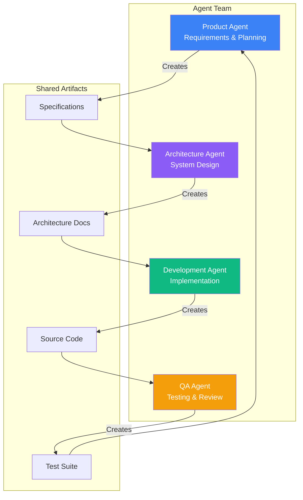
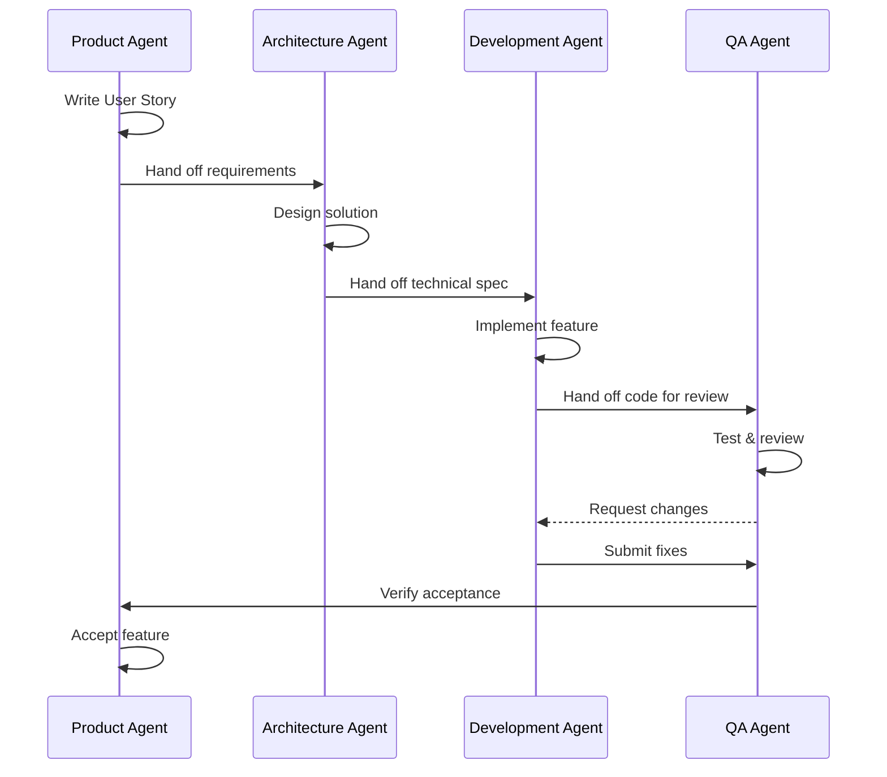
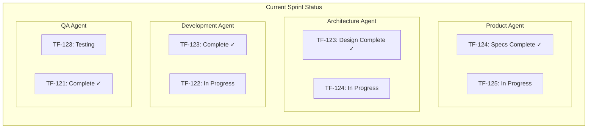
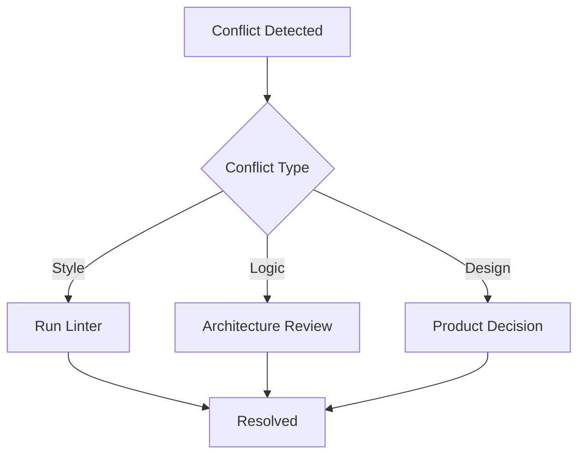
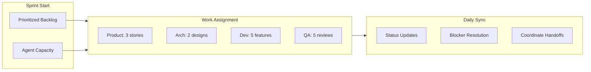
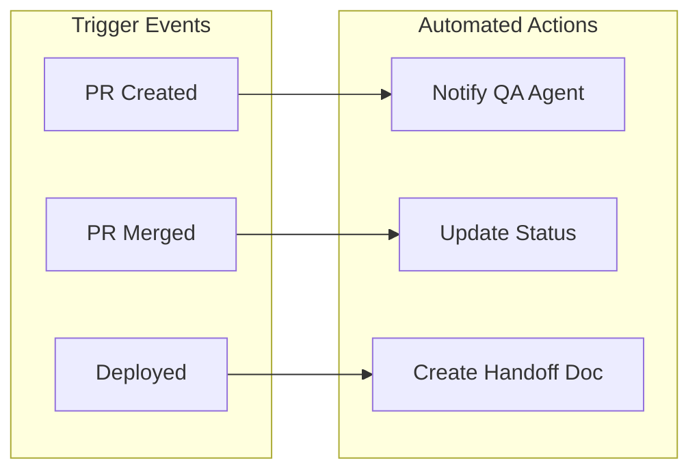

# TaskFlow Multi-Agent Coordination

## Overview

This document describes how multiple AI coding agents collaborate on TaskFlow development, including agent roles, handoff protocols, and coordination workflows.

---

## Agent Roles



---

## Agent Responsibilities

### Product Agent

```markdown
## Product Agent Responsibilities

### Primary Tasks
- Gather and clarify requirements
- Write user stories and acceptance criteria
- Prioritize backlog items
- Review features against requirements

### Artifacts Produced
- User stories in docs/stories/
- Feature specifications
- Acceptance criteria
- Sprint planning documents

### Handoff To
- Architecture Agent: Feature requirements
- QA Agent: Acceptance criteria for testing
```

### Architecture Agent

```markdown
## Architecture Agent Responsibilities

### Primary Tasks
- Design system architecture
- Define API contracts
- Plan database schema changes
- Document technical decisions

### Artifacts Produced
- Architecture documents in docs/architecture/
- API specifications
- Database migration plans
- Technical design documents

### Handoff To
- Development Agent: Technical specifications
- QA Agent: Integration test requirements
```

### Development Agent

```markdown
## Development Agent Responsibilities

### Primary Tasks
- Implement features according to specs
- Write unit tests
- Follow coding standards
- Create pull requests

### Artifacts Produced
- Source code in src/
- Unit tests in tests/unit/
- Code documentation
- Implementation notes

### Handoff To
- QA Agent: Code for review and testing
- Architecture Agent: Implementation feedback
```

### QA Agent

```markdown
## QA Agent Responsibilities

### Primary Tasks
- Review code for quality
- Write integration and E2E tests
- Verify acceptance criteria
- Report bugs and issues

### Artifacts Produced
- Integration tests in tests/integration/
- E2E tests in tests/e2e/
- Test reports
- Bug reports

### Handoff To
- Development Agent: Bug fixes needed
- Product Agent: Feature verification
```

---

## Coordination Workflow

### Feature Development Flow



### Handoff Protocol

```yaml
# Handoff Document Structure
handoff:
  from: development-agent
  to: qa-agent
  timestamp: 2024-01-15T10:30:00Z

  feature:
    id: TF-123
    title: Task Labels
    branch: feature/TF-123-task-labels

  changes:
    - file: src/services/labelService.ts
      type: new
      description: Label CRUD service
    - file: src/controllers/labelController.ts
      type: new
      description: Label API endpoints
    - file: src/components/LabelPicker.tsx
      type: new
      description: Label selection component

  testing_notes: |
    - Test label creation with max length
    - Test duplicate label names
    - Test label deletion with tasks attached

  open_questions:
    - Should deleting a label remove it from all tasks?
```

---

## Communication Channels

### Structured Handoffs

```
┌─────────────────────────────────────────────────────────────┐
│                    HANDOFF: TF-123                          │
├─────────────────────────────────────────────────────────────┤
│                                                             │
│  From: Development Agent                                    │
│  To: QA Agent                                               │
│  Status: Ready for Review                                   │
│                                                             │
│  ─────────────────────────────────────────────────────────  │
│                                                             │
│  Summary:                                                   │
│  Implemented task labels feature including:                 │
│  - Label CRUD API endpoints                                 │
│  - Label service with business logic                        │
│  - LabelPicker component for UI                             │
│  - Unit tests for service layer                             │
│                                                             │
│  ─────────────────────────────────────────────────────────  │
│                                                             │
│  Files Changed: 12                                          │
│  Tests Added: 8                                             │
│  Test Coverage: 82%                                         │
│                                                             │
│  ─────────────────────────────────────────────────────────  │
│                                                             │
│  Blocking Issues: None                                      │
│  Dependencies: None                                         │
│                                                             │
└─────────────────────────────────────────────────────────────┘
```

### Agent Status Board



---

## Conflict Resolution

### Code Conflicts



### Resolution Protocol

```markdown
## Conflict Resolution Steps

### 1. Identify Conflict Type
- Code style: Automated resolution via linter
- Implementation approach: Architecture agent decides
- Feature scope: Product agent decides
- Test coverage: QA agent decides

### 2. Resolution Process
1. Document the conflict
2. Identify decision owner
3. Present options with pros/cons
4. Record decision rationale
5. Update relevant documentation

### 3. Example Resolution
Conflict: Whether to use REST or GraphQL for labels API

Decision Owner: Architecture Agent
Resolution: Use REST for consistency with existing APIs
Rationale: Team familiarity, simpler caching, established patterns
Documentation: Updated in docs/architecture/decisions/
```

---

## Sprint Coordination

### Sprint Planning



### Daily Sync Format

```markdown
## Daily Agent Sync

### Product Agent
- Yesterday: Completed TF-124 user story
- Today: Writing specs for TF-125
- Blockers: Need UX designs for filter UI
- Handoffs: TF-124 ready for Architecture

### Architecture Agent
- Yesterday: Designed TF-123 API
- Today: Starting TF-124 design
- Blockers: None
- Handoffs: TF-123 spec ready for Development

### Development Agent
- Yesterday: Implemented label service
- Today: Building LabelPicker component
- Blockers: Waiting for API spec review
- Handoffs: TF-122 ready for QA

### QA Agent
- Yesterday: Tested TF-121 (passed)
- Today: Review TF-122 code
- Blockers: None
- Handoffs: TF-121 verified, ready for release
```

---

## Quality Gates

### Handoff Checklists

```yaml
# Product -> Architecture Handoff
product_to_arch:
  required:
    - [ ] User story complete
    - [ ] Acceptance criteria defined
    - [ ] Edge cases documented
    - [ ] Priority assigned

# Architecture -> Development Handoff
arch_to_dev:
  required:
    - [ ] Technical design complete
    - [ ] API contracts defined
    - [ ] Database changes documented
    - [ ] Dependencies identified

# Development -> QA Handoff
dev_to_qa:
  required:
    - [ ] Code complete
    - [ ] Unit tests passing
    - [ ] Code self-reviewed
    - [ ] Documentation updated

# QA -> Product Handoff
qa_to_product:
  required:
    - [ ] All tests passing
    - [ ] Code review approved
    - [ ] No critical bugs
    - [ ] Ready for demo
```

### Quality Metrics

```markdown
## Agent Performance Metrics

### Velocity
- Stories completed per sprint
- Features delivered per week
- Bug fix turnaround time

### Quality
- Bugs found in code review
- Test coverage percentage
- Rework rate (changes after handoff)

### Collaboration
- Handoff completion rate
- Blocker resolution time
- Documentation completeness
```

---

## Tooling Integration

### Shared Tools

| Tool | Purpose | Agents |
|------|---------|--------|
| GitHub | Code & PRs | All |
| Linear | Issue tracking | All |
| Figma | UI designs | Product, Dev |
| Notion | Documentation | All |
| Slack | Communication | All |

### Automation



---

## Best Practices

### Communication

```markdown
## Agent Communication Best Practices

1. **Clear Handoffs**
   - Use structured handoff templates
   - Include all relevant context
   - Specify blocking dependencies

2. **Timely Updates**
   - Update status daily
   - Flag blockers immediately
   - Acknowledge handoffs promptly

3. **Documentation**
   - Document decisions
   - Keep specs up to date
   - Note lessons learned

4. **Feedback Loops**
   - Regular retrospectives
   - Process improvement suggestions
   - Cross-agent pair working
```

---

## Related Documents

- [Sprint Execution](./sprint-execution.md)
- [Development Workflow](./development.md)
- [QA Review Process](./qa-review.md)
