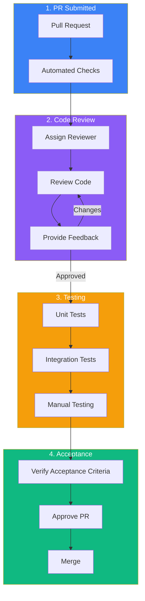
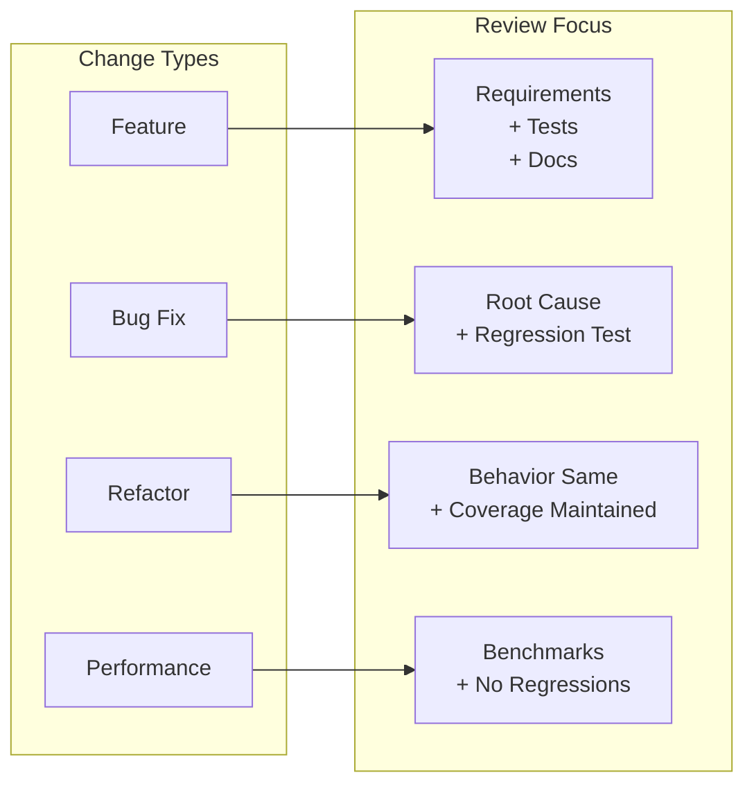
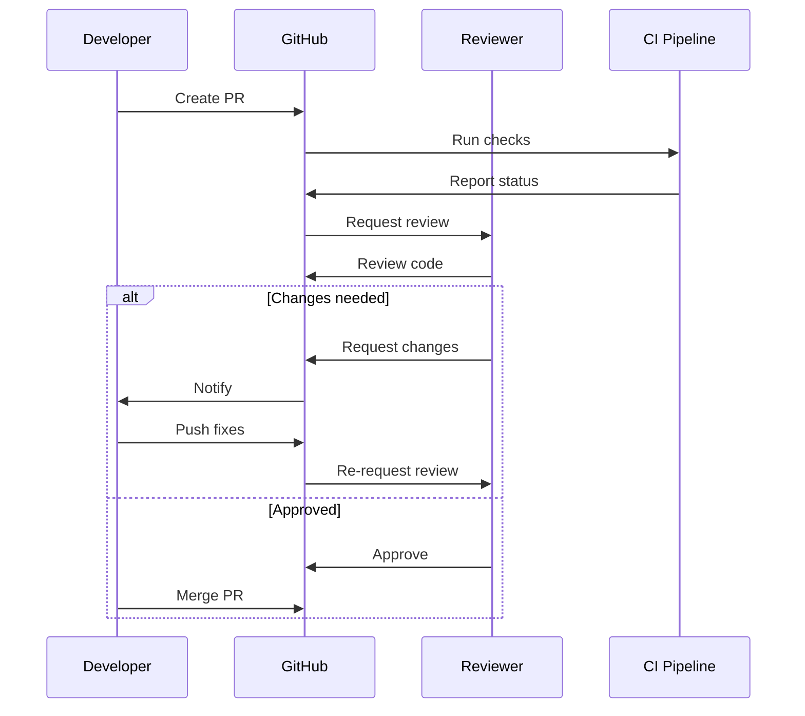

# TaskFlow QA Review Process

## Overview

This document outlines the quality assurance review process for TaskFlow, including code review guidelines, testing requirements, and acceptance criteria verification.

---

## QA Review Workflow



---

## Code Review Checklist

### General Code Quality

```markdown
## Code Quality Checklist

### Readability
- [ ] Code is self-documenting
- [ ] Variable names are descriptive
- [ ] Functions are small and focused
- [ ] Complex logic has comments

### Structure
- [ ] Single responsibility principle followed
- [ ] No code duplication
- [ ] Proper error handling
- [ ] Consistent formatting

### Performance
- [ ] No obvious performance issues
- [ ] Database queries are optimized
- [ ] No memory leaks
- [ ] Proper caching used

### Security
- [ ] Input validation present
- [ ] No sensitive data logged
- [ ] SQL injection prevented
- [ ] XSS protection in place
```

### TypeScript Specific

```markdown
## TypeScript Review Checklist

### Types
- [ ] No `any` types without justification
- [ ] Interfaces/types defined for data structures
- [ ] Proper use of generics
- [ ] Strict null checks handled

### Patterns
- [ ] Async/await used correctly
- [ ] Proper error typing
- [ ] No type assertions without reason
- [ ] Enums used appropriately
```

### React Specific

```markdown
## React Review Checklist

### Components
- [ ] Components are reasonably sized
- [ ] Props are typed correctly
- [ ] No prop drilling (use context/state)
- [ ] Keys used properly in lists

### Hooks
- [ ] Dependencies arrays are correct
- [ ] No unnecessary re-renders
- [ ] Custom hooks follow conventions
- [ ] Effects cleaned up properly

### State Management
- [ ] State is appropriately scoped
- [ ] Server state uses React Query
- [ ] Client state uses Zustand
- [ ] No state duplication
```

---

## Review Categories

### By Change Type



### Review Depth Guide

| PR Size | Lines | Review Time | Focus |
|---------|-------|-------------|-------|
| Small | < 50 | 15 min | Full review |
| Medium | 50-200 | 30-45 min | Key logic + tests |
| Large | 200-500 | 1-2 hours | Architecture + samples |
| XL | > 500 | Request split | High risk areas only |

---

## Testing Requirements

### Test Coverage Requirements

```markdown
## Minimum Coverage Requirements

### Backend
- Unit tests: 80% coverage
- Integration tests: Key API endpoints
- Service layer: 90% coverage

### Frontend
- Component tests: 70% coverage
- Hook tests: 80% coverage
- Integration: Key user flows

### Critical Paths (100% required)
- Authentication flows
- Data mutation operations
- Payment processing (future)
```

### Test Quality Criteria

```typescript
// Good Test Example
describe('TaskService', () => {
  describe('createTask', () => {
    it('should create task with valid data', async () => {
      // Arrange
      const userId = 'user-123';
      const taskData = {
        title: 'Test Task',
        description: 'Test description',
        dueDate: new Date('2024-02-01'),
      };

      // Act
      const task = await taskService.createTask(userId, taskData);

      // Assert
      expect(task).toMatchObject({
        title: 'Test Task',
        description: 'Test description',
        userId: 'user-123',
        status: 'pending',
      });
      expect(task.id).toBeDefined();
      expect(task.createdAt).toBeInstanceOf(Date);
    });

    it('should throw error for empty title', async () => {
      // Arrange
      const userId = 'user-123';
      const taskData = { title: '' };

      // Act & Assert
      await expect(
        taskService.createTask(userId, taskData)
      ).rejects.toThrow('Title is required');
    });

    it('should create task without optional fields', async () => {
      // Arrange
      const userId = 'user-123';
      const taskData = { title: 'Minimal Task' };

      // Act
      const task = await taskService.createTask(userId, taskData);

      // Assert
      expect(task.title).toBe('Minimal Task');
      expect(task.description).toBeNull();
      expect(task.dueDate).toBeNull();
    });
  });
});
```

### Test Anti-Patterns to Catch

```markdown
## Test Anti-Patterns

### Avoid
- [ ] Tests with no assertions
- [ ] Tests that always pass
- [ ] Overly complex test setup
- [ ] Testing implementation details
- [ ] Flaky tests
- [ ] Tests dependent on order

### Example Bad Test
```typescript
// BAD: No real assertion
it('should work', () => {
  const result = doSomething();
  expect(result).toBeTruthy(); // Too vague
});

// BAD: Testing implementation
it('should call save method', () => {
  // Testing HOW not WHAT
  expect(repository.save).toHaveBeenCalled();
});
```
```

---

## Manual Testing Scenarios

### Feature Testing Template

```markdown
## Manual Test: Task Labels Feature

### Prerequisites
- Logged in as test user
- At least 3 tasks exist

### Test Scenarios

#### TC-001: Create Label
Steps:
1. Navigate to Settings > Labels
2. Click "Create Label"
3. Enter name: "Work"
4. Select color: Blue
5. Click Save

Expected:
- Label appears in label list
- Success toast shown
- Label available in task editor

Result: [ ] Pass [ ] Fail

#### TC-002: Add Label to Task
Steps:
1. Open any task
2. Click label picker
3. Select "Work" label
4. Save task

Expected:
- Label badge shown on task
- Task appears in filtered view
- Label count increases

Result: [ ] Pass [ ] Fail

#### TC-003: Filter by Label
Steps:
1. Navigate to task list
2. Click filter dropdown
3. Select "Work" label

Expected:
- Only tasks with "Work" label shown
- Filter indicator visible
- Clear filter works

Result: [ ] Pass [ ] Fail
```

### Exploratory Testing

```markdown
## Exploratory Testing Session

### Charter
Explore task labels feature for edge cases and usability issues.

### Time Box
30 minutes

### Areas to Explore
- Label name limits
- Special characters in names
- Many labels on one task
- Mobile responsiveness
- Keyboard navigation
- Screen reader compatibility

### Notes
[Document findings here]

### Bugs Found
| Bug | Severity | Notes |
|-----|----------|-------|
| | | |
```

---

## Acceptance Criteria Verification

### Verification Template

```markdown
## AC Verification: TF-123 Task Labels

### User Story
As a user, I want to add labels to tasks so I can categorize my work.

### Acceptance Criteria

| # | Criterion | Status | Notes |
|---|-----------|--------|-------|
| 1 | User can create labels with name and color | ✅ Pass | |
| 2 | User can add up to 5 labels per task | ✅ Pass | |
| 3 | User can filter tasks by label | ✅ Pass | |
| 4 | Labels persist across sessions | ✅ Pass | |
| 5 | User can edit existing labels | ✅ Pass | |
| 6 | User can delete labels | ✅ Pass | Confirms removal from tasks |

### Edge Cases Tested

| Scenario | Result |
|----------|--------|
| Empty label name | Validation error shown |
| Duplicate name | Error prevents creation |
| Delete label with tasks | Warning shown, removes from tasks |
| 6th label on task | Prevented with message |

### Overall Status: ✅ APPROVED
```

---

## Review Workflow

### Review Request



### Review Feedback Guidelines

```markdown
## Giving Feedback

### Be Specific
❌ "This is confusing"
✅ "Consider extracting this logic into a separate function for readability"

### Explain Why
❌ "Use a constant here"
✅ "Use a constant here to avoid magic numbers and make the timeout configurable"

### Suggest Alternatives
❌ "Don't do it this way"
✅ "Consider using Array.filter() here for better readability: `items.filter(i => i.active)`"

### Differentiate Severity
- 🔴 **Blocking**: Must fix before merge
- 🟡 **Suggestion**: Would improve code, optional
- 💭 **Question**: Seeking clarification
- ℹ️ **Note**: FYI, no action needed
```

---

## QA Sign-off

### Final Checklist

```markdown
## QA Sign-off: TF-123

### Automated Checks
- [x] CI pipeline passes
- [x] Unit tests pass (82% coverage)
- [x] Integration tests pass
- [x] No linting errors
- [x] Type check passes

### Code Review
- [x] Code reviewed and approved
- [x] All feedback addressed
- [x] No security concerns
- [x] Performance acceptable

### Testing
- [x] Manual test cases pass
- [x] Acceptance criteria verified
- [x] Edge cases tested
- [x] Regression tested

### Documentation
- [x] API docs updated
- [x] User guide updated (if needed)
- [x] Release notes drafted

### Final Sign-off
Approved by: QA Agent
Date: 2024-01-15
Status: ✅ Ready for merge
```

---

## Metrics and Reporting

### QA Metrics

```markdown
## Sprint QA Metrics

### Code Review
- PRs reviewed: 12
- Average review time: 4 hours
- Rework rate: 15%

### Testing
- Test cases executed: 45
- Pass rate: 98%
- Bugs found: 3 (2 medium, 1 low)

### Quality
- Code coverage: 78% (+2%)
- Critical bugs in prod: 0
- Customer-reported bugs: 1
```

---

## Related Documents

- [Testing Strategy](../testing/strategy.md)
- [Development Workflow](./development.md)
- [Bug Fix Workflow](./bug-fix.md)
