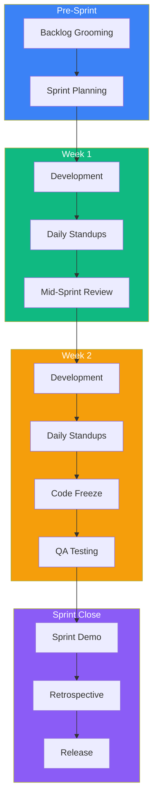
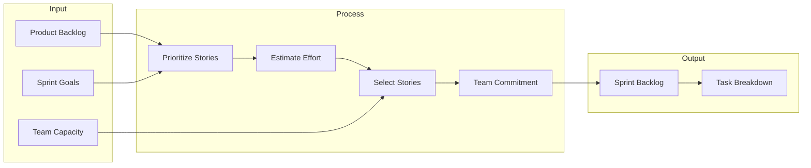
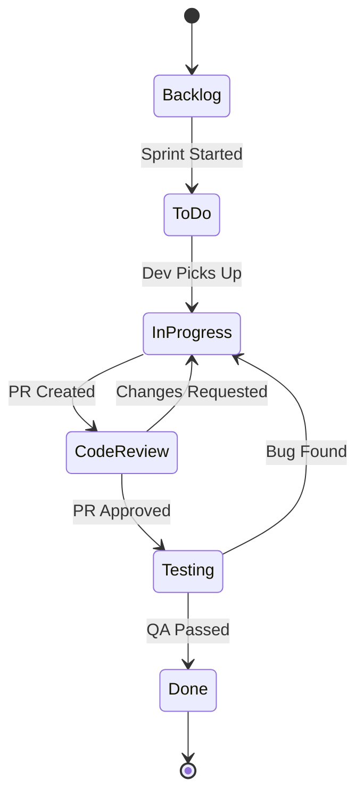
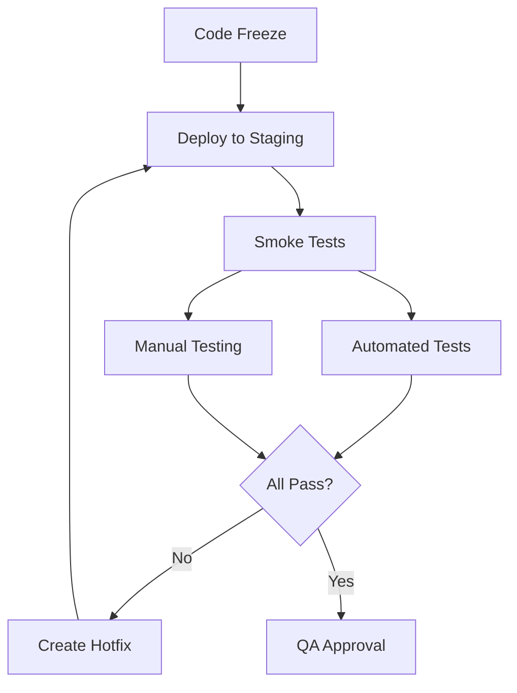
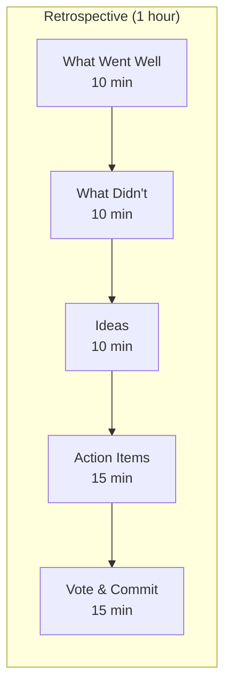
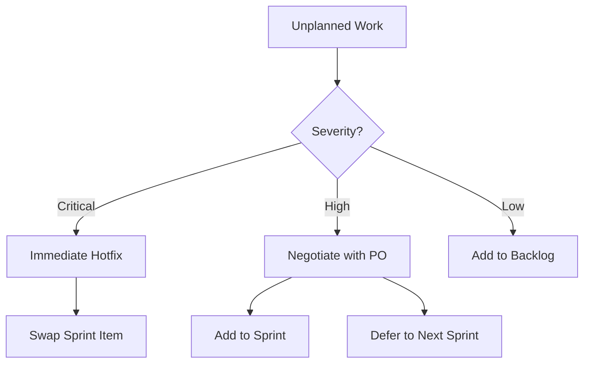

# TaskFlow Sprint Execution Guide

## Overview

TaskFlow uses 2-week sprints to deliver incremental value. This guide covers the complete sprint lifecycle from planning to retrospective.

---

## Sprint Lifecycle



---

## Sprint Calendar

| Day | Activity | Duration | Participants |
|-----|----------|----------|--------------|
| Day -2 | Backlog Grooming | 1 hour | Team + PO |
| Day 1 | Sprint Planning | 2 hours | Full Team |
| Daily | Standup | 15 min | Dev Team |
| Day 5 | Mid-Sprint Review | 30 min | Dev Team |
| Day 9 | Code Freeze | - | Dev Team |
| Day 10 | QA Testing | Full day | QA + Dev |
| Day 10 | Sprint Demo | 1 hour | Team + Stakeholders |
| Day 10 | Retrospective | 1 hour | Dev Team |

---

## Phase 1: Sprint Planning

### 1.1 Pre-Planning Checklist

```markdown
Before Sprint Planning:
- [ ] Backlog is groomed and prioritized
- [ ] Stories have acceptance criteria
- [ ] Technical designs are ready for complex items
- [ ] Dependencies are identified
- [ ] Team capacity is calculated
```

### 1.2 Capacity Calculation

```
Sprint Capacity Formula:
------------------------
Team Members: 4
Days per Sprint: 10
Hours per Day: 6 (accounting for meetings, breaks)
Base Capacity: 4 * 10 * 6 = 240 hours

Adjustments:
- PTO: -12 hours (2 days)
- Training: -6 hours
- Available: 222 hours

Story Points Velocity: 34 points (based on 3-sprint average)
```

### 1.3 Sprint Backlog Selection



### 1.4 Story Point Reference

| Points | Description | Example |
|--------|-------------|---------|
| 1 | Trivial change | Fix typo, update config |
| 2 | Small change | Add validation, simple UI tweak |
| 3 | Medium feature | New API endpoint with tests |
| 5 | Standard feature | CRUD functionality |
| 8 | Large feature | New module with multiple components |
| 13 | Epic-sized | Full feature set, needs breakdown |

---

## Phase 2: Sprint Execution

### 2.1 Daily Standup Format

```
Standup Questions:
------------------
1. What did you complete yesterday?
2. What will you work on today?
3. Are there any blockers?

Time: 9:30 AM daily
Duration: 15 minutes max
Format: Round-robin
```

### 2.2 Task Board Workflow



### 2.3 Work In Progress Limits

```
WIP Limits:
-----------
In Progress: 2 items per developer
Code Review: 4 items total
Testing: 6 items total

Rationale:
- Encourages completing work before starting new
- Reduces context switching
- Identifies bottlenecks quickly
```

### 2.4 Sprint Metrics Dashboard

```
+------------------------------------------------------------------+
|                    SPRINT 5 DASHBOARD                             |
+------------------------------------------------------------------+
|                                                                   |
|  Progress: ████████████░░░░░░░░  60%   Day 6 of 10               |
|                                                                   |
|  Story Points:                                                    |
|  Committed: 34    Completed: 21    Remaining: 13                 |
|                                                                   |
|  Burndown:                                                        |
|  34 |*                                                           |
|     | *                                                          |
|  25 |  *  *                                                      |
|     |     *                                                      |
|  15 |      *  * ←  Actual                                        |
|     |         -------- Ideal                                     |
|   5 |              --------                                      |
|   0 +-----|-----|-----|-----|-----|-----|-----|-----|-----|      |
|     D1    D2    D3    D4    D5    D6    D7    D8    D9    D10    |
|                                                                   |
+------------------------------------------------------------------+
```

### 2.5 Mid-Sprint Review

```markdown
Mid-Sprint Review Agenda (Day 5):
---------------------------------
1. Progress check (15 min)
   - Stories completed vs planned
   - Burndown analysis

2. Blocker resolution (10 min)
   - Identify impediments
   - Assign owners for resolution

3. Scope adjustment (5 min)
   - Pull in more work if ahead
   - Negotiate scope if behind
```

---

## Phase 3: Code Freeze & QA

### 3.1 Code Freeze Criteria

```markdown
Code Freeze Checklist (Day 9, 5 PM):
------------------------------------
- [ ] All feature PRs merged to main
- [ ] No critical bugs in staging
- [ ] All unit tests passing
- [ ] Integration tests green
- [ ] Release notes drafted
```

### 3.2 QA Testing Phase



### 3.3 Bug Severity Matrix

| Severity | Description | Action | Example |
|----------|-------------|--------|---------|
| Critical | System down | Hotfix immediately | Login broken |
| High | Major feature broken | Fix before release | Cannot create task |
| Medium | Feature degraded | Fix if time permits | Slow task loading |
| Low | Minor issue | Next sprint | UI alignment off |

---

## Phase 4: Sprint Closing

### 4.1 Sprint Demo Structure

```
Sprint Demo Agenda (1 hour):
----------------------------
1. Sprint Goal Recap (5 min)
   - What we set out to achieve

2. Demo Features (40 min)
   - Live demonstration
   - Each developer demos their work

3. Metrics Review (10 min)
   - Velocity comparison
   - Quality metrics

4. Q&A (5 min)
   - Stakeholder questions
```

### 4.2 Retrospective Format



### 4.3 Retrospective Template

```markdown
## Sprint 5 Retrospective

### What Went Well
- Fast PR reviews, under 24 hours average
- Good collaboration on task labels feature
- Zero critical bugs in release

### What Didn't Go Well
- Mid-sprint scope change caused stress
- Flaky tests slowed down CI
- Documentation not updated

### Action Items
| Action | Owner | Due |
|--------|-------|-----|
| Fix flaky tests | @dev1 | Sprint 6 Day 3 |
| Add scope change process | @lead | Sprint 6 Day 1 |
| Documentation review | @dev2 | Each PR |
```

---

## Sprint Execution Checklist

```markdown
## Daily
- [ ] Attend standup
- [ ] Update task status
- [ ] Review PRs

## Weekly
- [ ] Update burndown
- [ ] Check WIP limits
- [ ] Mid-sprint review (Day 5)

## Sprint End
- [ ] Code freeze (Day 9)
- [ ] QA testing (Day 10)
- [ ] Sprint demo
- [ ] Retrospective
- [ ] Release to production
```

---

## Handling Sprint Disruptions

### Unplanned Work



### Scope Change Protocol

```
If scope change requested:
1. Assess impact with team
2. Identify items to remove (equal story points)
3. Get PO approval for swap
4. Document in sprint notes
5. Never exceed sprint capacity
```

---

## Related Documents

- [Development Workflow](./development.md)
- [QA Review Process](./qa-review.md)
- [Deployment Process](./deployment.md)
